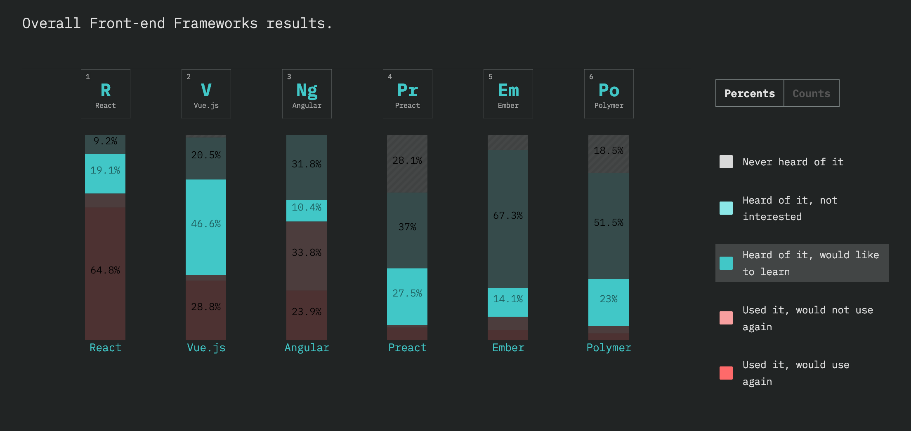

# 2nd Apr `getting-started-in-vue` workshop with Coding Girls

Learn about the frontend framework everyone is talking about. VueJS empowers you to build highly interactive web app but at the same time is beginner friendly so you can spend more time creating and less time debugging. 

At [Straits Times Interactive Graphics Team](https://graphics.straitstimes.com), we use Vue to create awesome interactives like [*this*](https://graphics.straitstimes.com/STI/STIMEDIA/Interactives/2018/09/world-passport/index.html), [*this*](https://graphics.straitstimes.com/STI/STIMEDIA/Interactives/2018/07/ndp-hunt/index.html) and [*this*](https://graphics.straitstimes.com/STI/STIMEDIA/Interactives/2019/02/HK-Beijing-HSR/index.html). This will be a sharing session cum hands-on workshop where together we will build a simple app using VueJS.

## Topics

- Why use a frontend framework? What problem are we trying to solve?
- How is Vue different from React?
- Template: Separating your markup from your content
- Components: Modularizing your frontend code
- Data reactivity - Content, structure & style
- Using computed properties
- Event binding

## Pre-requisite

- Editor: VSCode or Atom
  - Install extension vetur (VSCode) or language-vue (Atom)
  - Eslint (recommemded)
- Browser: Chrome or Firefox
  - Vue devtool extension installed **(highly recommended)**

## About the speaker

Yong Jun produces data stories and interactive graphics for SPH Straits Times as a Senior Web Developer. An early adopter of VueJS, he thinks Vue is the best thing to have come to the Javascript world since ES6. The popular GovTech visualization project [SchoolPicker.sg](https://schoolpicker.yongjun.sg) was created by him using VueJS. He enjoys writing code and teaching people the art of code writing. 
